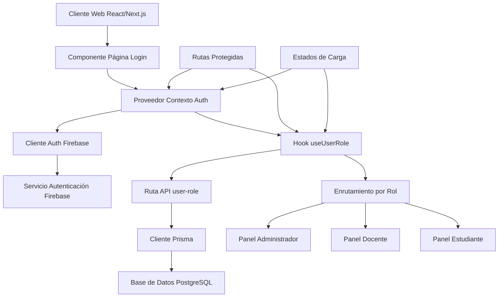
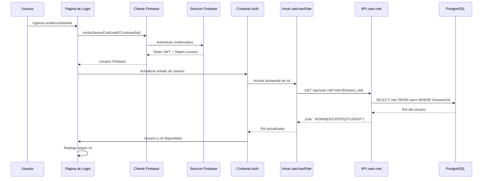
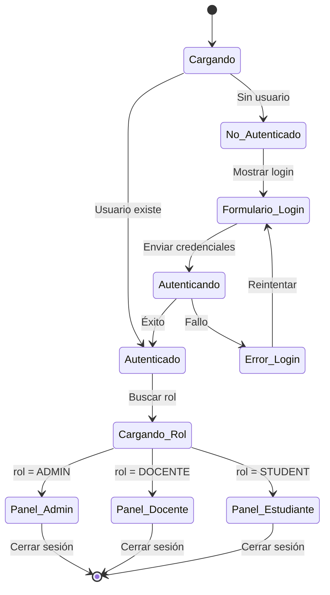
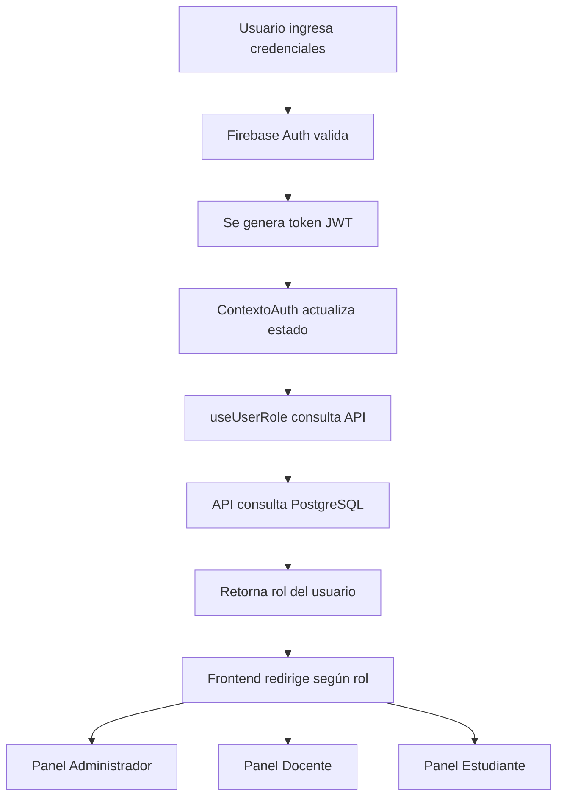

# Diagrama de Servicios - Sistema de Login AulaUnida

## Arquitectura del Sistema de Autenticación

## Flujo de Autenticación Detallado

### 1. **Inicio de Sesión**

### 2. **Componentes del Sistema**

#### **Componentes del Frontend:**
- `PáginaLogin` - Formulario de autenticación
- `ContextoAuth` - Manejo global del estado de autenticación
- `useAuth()` - Hook para acceder al estado de autenticación
- `useUserRole()` - Hook para obtener el rol del usuario
- `RutaProtegida` - Componente para rutas protegidas

#### **Servicios del Backend:**
- `Autenticación Firebase` - Servicio de autenticación
- `/api/user-role` - API para obtener roles desde PostgreSQL
- `Cliente Prisma` - ORM para base de datos
- `PostgreSQL` - Base de datos principal

#### **Archivos de Configuración:**
- `firebaseClient.ts` - Configuración de Firebase para cliente
- `firebaseAdmin.ts` - Configuración de Firebase para servidor
- `authContext.tsx` - Contexto de React para autenticación

### 3. **Estados de la Aplicación**

### 4. **Tecnologías Utilizadas**

| Componente | Tecnología | Propósito |
|------------|------------|-----------|
| **Frontend** | Next.js 15 + React | Framework web principal |
| **Autenticación** | Firebase Auth | Gestión de identidades |
| **Estado Global** | React Context | Manejo de estado de usuario |
| **Base de Datos** | PostgreSQL | Almacenamiento de datos |
| **ORM** | Prisma | Acceso a base de datos |
| **API Routes** | Next.js API Routes | Endpoints del servidor |
| **Estilos** | CSS Modules | Estilos componentes |

### 5. **Flujo de Datos**

### 6. **Seguridad**

- **Tokens JWT**: Firebase genera tokens seguros para cada sesión
- **Verificación server-side**: Los tokens se verifican en el servidor
- **Roles en BD**: Los permisos están almacenados en PostgreSQL
- **Rutas protegidas**: Middleware de autenticación en componentes sensibles
- **Logout seguro**: Limpieza completa del estado al cerrar sesión

### 7. **Puntos de Extensión**

- **Autenticación social**: Agregar login con Google/Facebook
- **Autenticación de dos factores (2FA)**: Implementar seguridad adicional
- **Gestión avanzada de sesiones**: Manejo mejorado de sesiones
- **Permisos granulares**: Sistema de permisos por funcionalidad
- **Registros de auditoría**: Registro detallado de actividades de login

---

*Diagrama generado para AulaUnida - Sistema de Gestión Académica*
*Fecha: Noviembre 2025*